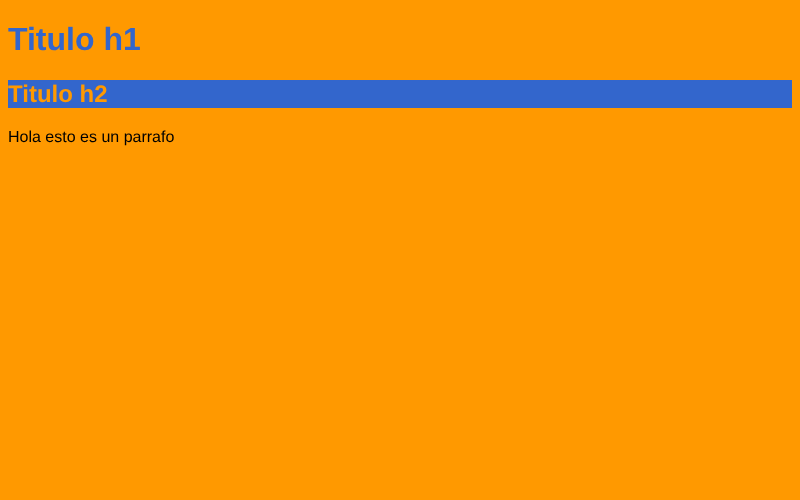
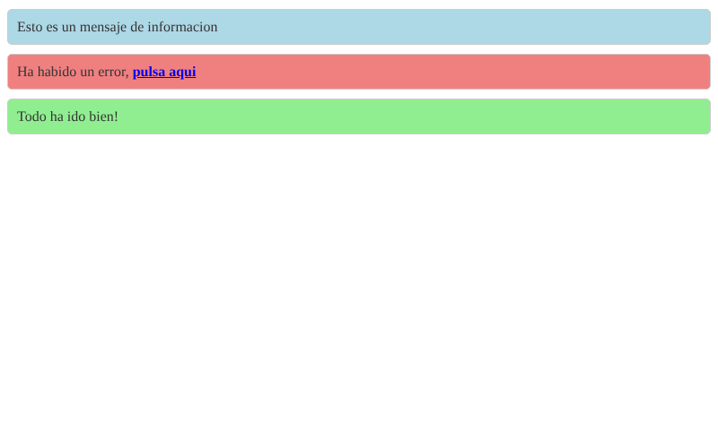
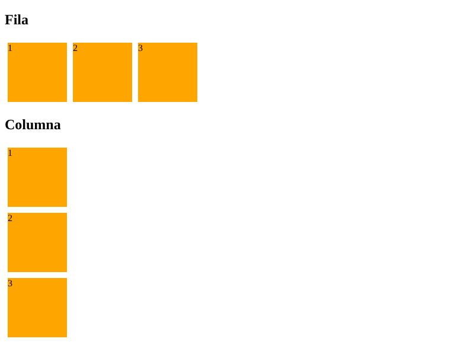
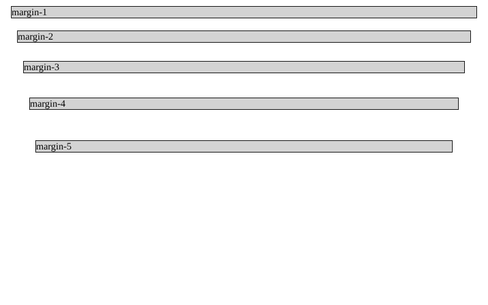
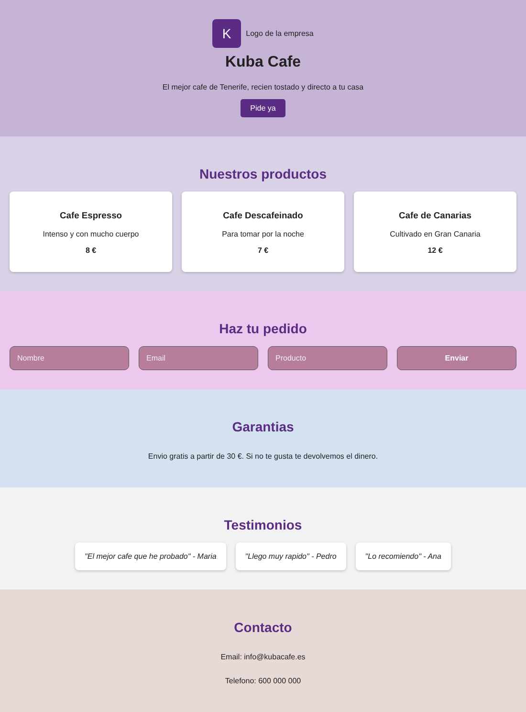
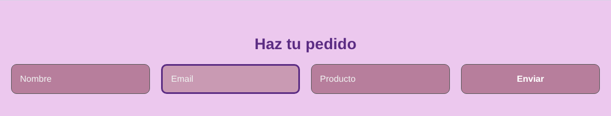

# Practica Sass

Alumno: Jakub Gugulski (Erasmus)


## Ejercicio 2 - Variables

En `ej2/_variables.scss` defino `$color-primario` y `$color-secundario`, y en `ej2/estilos.scss` los importo con `@import` y los uso en `body`, `h1` y `h2`.
En el CSS generado (`ej2/estilos.css`) se ve que las variables se han cambiado por los colores, asi que se han aplicado bien.



## Ejercicio 3 - Mensajes de estado

El estilo base esta en el parcial `ej3/_mensaje-base.scss` como placeholder `%mensaje`. Como empieza por `_` no se compila solo (no sale ningun `_mensaje-base.css`).
En `ej3/mensajes.scss` hago `@extend %mensaje` para info (azul), error (rojo) y exito (verde). Los enlaces dentro del error estan en negrita.



## Ejercicio 4 - Mixins

Mixin `flex-direccion($direccion)` para la direccion del flexbox y mixin `tamano($ancho, $alto)` para el tamaño. Los pruebo con unas cajas en fila y en columna.



## Ejercicio 5 - Bucle @for

Con `@for $i from 1 through 5` genero `.margin-1` hasta `.margin-5`, con `margin: $i * 10px`. CSS generado:

```css
.margin-1 {
  margin: 10px;
}

.margin-2 {
  margin: 20px;
}

.margin-3 {
  margin: 30px;
}

.margin-4 {
  margin: 40px;
}

.margin-5 {
  margin: 50px;
}
```



## Landing Page (Flex + Grid + Sass)

Pagina web siguiendo el mockup: cabecera con logo, nombre, beneficios y llamada a la accion, productos, formulario, garantias, testimonios y contacto.

- **Flex**: cabecera, garantias y contacto (centrados con el mixin `centrar`), lista de testimonios.
- **Grid**: lista de productos (3 columnas) y formulario (4 columnas).

Estructura de Sass en `landing/scss/`:

- `_variables.scss`: colores, fuente y espacio.
- `_mixins.scss`: mixin `encabezado` para los h2, mixin `centrar` para centrar contenido y mixin `estilo-form` para los elementos del form.
- `_base.scss`: estilos comunes para todas las paginas (body, secciones, h2).
- `estilos.scss`: importa los parciales y define los estilos de cada seccion. Se transpila a `landing/css/estilos.css`.

Herencia: defino el estilo `.producto` y los clientes lo heredan con `@extend .producto`.
Anidamiento: los `input` y `button` estan anidados dentro de `form`, con `&:focus` para que se resalten cuando tienen el foco.



Input con el foco (borde morado):


